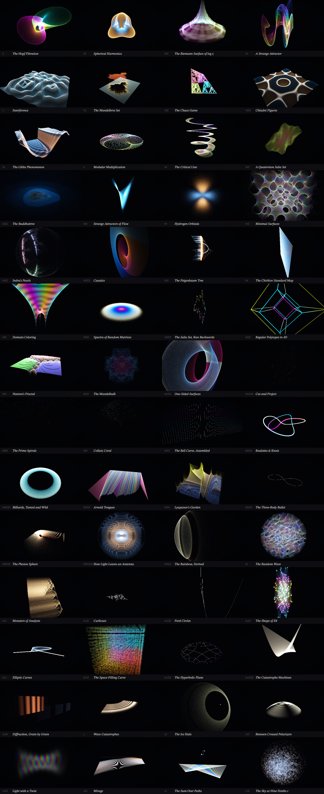
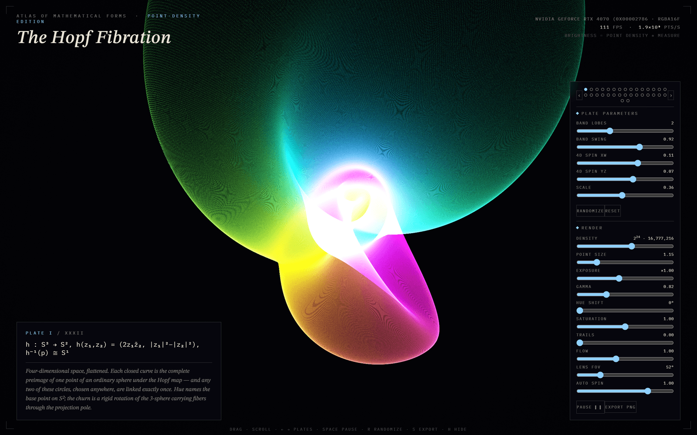
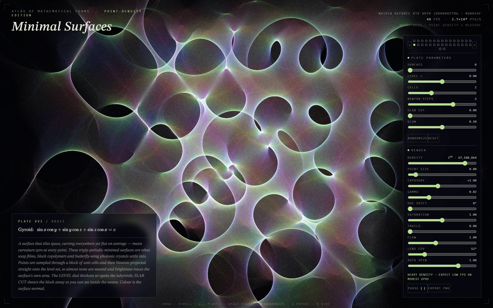
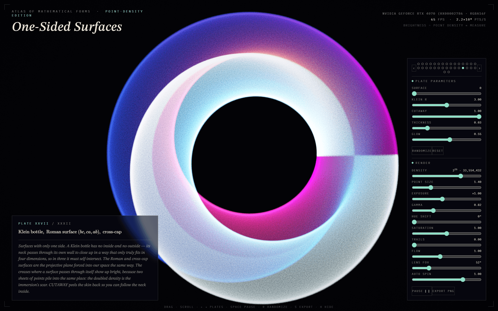
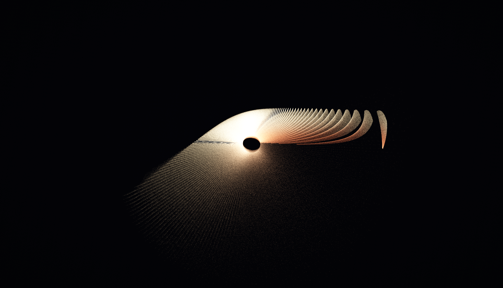
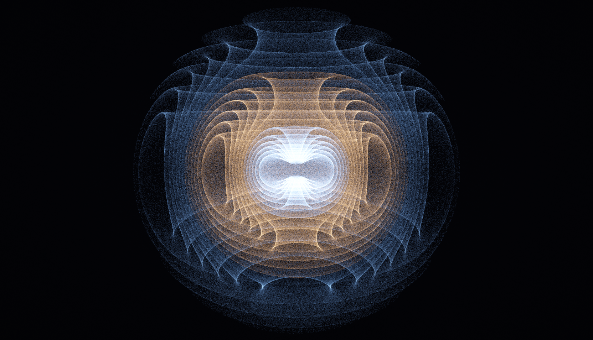
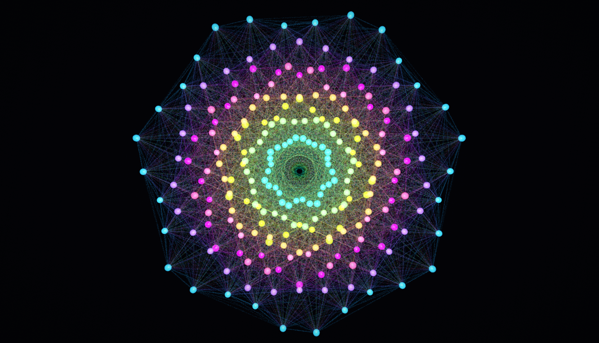
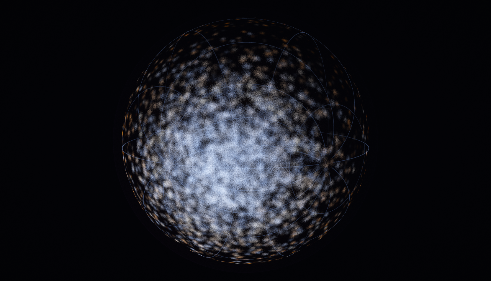

# Atlas of Mathematical Forms

A WebGL2 point-cloud atlas. Every plate is a mathematical object rendered as
up to 2^27 = 134,217,728 points, synthesized entirely in the vertex shader
from `gl_VertexID` — the project contains no vertex buffers at all. Points
are additively accumulated into a floating-point framebuffer and tonemapped,
so **brightness is a Monte-Carlo density estimate of each object's measure**.

Open `atlas/index.html` directly in a browser (no server or build step
needed), or use the prebuilt single file at `atlas/build/atlas-bundled.html`.
The site around it - the front door, the book, the prints - is written by
`build_site.py` into the repository root and served at prettycloud.io.

## Run it without a checkout

The whole atlas is also published as **one HTML file** with every script and
stylesheet inlined. Download it from
[Releases](https://github.com/loganw234/PrettyCloud/releases/latest) and open
it; that is the entire installation. No build step, no server, no
dependencies.

Rebuild it yourself with `python atlas/build.py`, which writes
`atlas/build/atlas-bundled.html`. Fonts and KaTeX are deliberately left as
CDN links, so fully offline the type falls back and formulas show as plain
LaTeX. Everything that draws is local.
## The plates

Sixty-eight in all, spanning topology, chaos, number theory, quantum mechanics, general
relativity, ergodic theory, Lie theory, hyperbolic geometry, catastrophe theory — and a
"Cabinet of Light": eight plates of wave, ray and relativistic optics (plates XLIX–LVI).
Every parameter on the right is live, and `R` randomizes the current plate's levers.



Seven of them full size:















## Structure

```
build_site.py               the front door, the book, the prints, the about page - one shell
p/<id>/                     one landing page per plate, where a printed card's QR arrives
og/                         the share cards
atlas/index.html            the atlas: markup + ordered <script> tags
atlas/css/atlas.css         museum-plate styling
atlas/js/core/registry.js   Atlas namespace, plate registration, shader assembly
atlas/js/core/glsl-lib.js   shared GLSL (vertex main, tonemap, trails)
atlas/js/core/renderer.js   GL state, per-pair shader cache, accumulation, PNG export
atlas/js/core/camera.js     orbit camera with inertia
atlas/js/core/ui.js         placard, lever racks, telemetry, keyboard
atlas/js/core/main.js       state machine + frame loop
atlas/js/plates/NN-*.js     one file per plate: the editorial half here, the shape half emitted by atlas-engine
atlas/shader-bisect.html    diagnostic: times shader compilation per plate subset
atlas/build.py              bundles the atlas into atlas/build/atlas-bundled.html
```

Plain script tags and a `globalThis.Atlas` namespace are used instead of ES
modules deliberately: modules are blocked on the `file://` protocol, and
this way the page works straight off the disk.

## Adding a plate

Since 2026-08-23 a plate is two halves in two repositories, and neither
owns both. The **shape** - the GLSL, the levers, the camera home, the
gain and the accent - is a *positive* in
[atlas-engine](https://github.com/loganw234/atlas-engine): a small
JavaScript program the engine's CPU evaluator runs and its emitter reads,
writing `shape_<id>` GLSL that is deterministic by construction. The
**editorial** half - name, roman numeral, formula, caption and the
plate's place in the order - lives here, in `atlas/js/plates/NN-<id>.js`,
registered with one `<script>` tag in `atlas/index.html` before the core
scripts. The darkroom merges the two into the registry every print is
made from, and refuses a plate that has only one half.

So: write the positive first (the engine's `docs/CONVERSION.md` says how,
and `docs/TEMPLATE.pos.mjs` is a real one to copy), emit it, and register
it here with the fields below. The example keeps its shape inline, which
is how every plate was written before the split and how the page still
reads them.

```js
Atlas.registerPlate({
  id: "yourthing",            // unique; becomes shape_yourthing in GLSL
  name: "Your Thing",
  roman: "XLIX",
  accent: "#88ccff",          // UI accent while this plate is active
  tex: "e^{i\\pi}+1=0",      // KaTeX for the placard
  plain: "e^ipi + 1 = 0",     // fallback if KaTeX fails to load
  caption: "One paragraph of honest mathematics.",
  cam: { dist: 3.4, pitch: 0.3, tgtY: 0, rot: 0.05 },  // camera home
  gain: 1.0,                  // brightness trim for this plate
  params: [                   // up to 8 levers -> P[0..7]
    { label: "KNOB", min: 0, max: 1, step: 0.01, def: 0.5 },
  ],
  glsl: `
vec3 shape_yourthing(vec2 q, vec4 rnd, uint seed, float P[8], out vec3 col){
  // q    : R2 low-discrepancy point in [0,1)^2  (your parameter space)
  // rnd  : four hashed uniforms per point
  // seed : a per-point uint, feed it to hashu() for more randomness
  // P    : this plate's lever values
  // col  : output color (pre-tonemap; magnitudes ~0.2-1.5 work well)
  col = vec3(1.0);
  return vec3(q - 0.5, 0.0);  // position in world space, roughly [-1.5,1.5]^3
}`
});
```

Helpers available inside plate GLSL: `pal()` (IQ cosine palettes),
`hashu()` (PCG-style uint hash), `u2f()` (uint -> [0,1) float), `PI`, `TAU`,
and the sim-time uniform `uT`. If a plate needs its own helper function,
prefix it with the plate id to avoid collisions (see `ifs_vertex` in
plate VII). To hide a point, return `vec3(0.0, -999.0, 0.0)` — it gets
clipped (see plate XII).

## Performance notes

- The R2 sequence is computed in exact 32-bit fixed point
  (`u2f(ia * 3242174889u)`); a float `fract(i*phi)` loses mantissa past
  ~16M indices and the cloud collapses onto stripes.
- Point intensity scales as `(W·H)/N`, so total energy — and therefore
  perceived brightness — is invariant under the DENSITY lever.
- TRAILS multiplies steady-state energy by `1/(1-persistence)`; intensity
  is scaled down to compensate, so the slider changes character, not
  exposure.
- Accumulation is RGBA16F (half-float). At extreme exposure × density the
  brightest pixels can saturate 16F; back off EXPOSURE before DENSITY.
- Point shaders are compiled **per morph pair**, never as one ubershader.
  Windows Chrome routes GLSL through D3D's HLSL compiler, whose cost grows
  super-quadratically with program size — one shader holding all 48 early
  plates took 92 s to compile, and past ~50 plates ANGLE's ~100 s watchdog
  kills the context outright. A 2-plate program links in well under a
  second, compiles asynchronously (`KHR_parallel_shader_compile`) while the
  previous plate keeps rendering, and is cached (LRU, plus Chrome's own
  disk cache). `shader-bisect.html` measures this on your machine.
- DENSITY is a ceiling, not a fixed count: rendering starts at 2^20 and a
  governor climbs one power per half-second while the frame rate holds
  above ~57 fps, retreating below ~42. First paint is immediate on any
  GPU; a desktop GPU (the project was aimed at an RTX 5060 Ti) reaches
  2^23 in about two seconds and holds 60 fps on most plates. 2^27 points
  is real work — expect ~8 GB/s of raster traffic at the top of the lever.

## The family

- [atlas-engine](https://github.com/loganw234/atlas-engine) - the plate
  language: a positive states a subject, and the emitter writes
  deterministic GLSL from it; it owns the shape half of every plate here.
  Public, MIT.
- [atlas-film](https://github.com/loganw234/atlas-film) - the medium:
  stocks, grain, the colour chain, papers and processes, as numbers with
  provenance. Public, MIT.
- [cft-fp256](https://github.com/loganw234/cft-fp256) - a deterministic
  IEEE 754-2019 coprocessor; a sibling in method rather than in code.
  Public, Apache-2.0.
- atlas-optical - the glass: the traced lens registry and the exact ray
  tracer that referees it. Private until its historic sources have
  answered.
- atlas-darkroom - the print engine pointed at these same objects, and the
  commons that renders the largest of them; its public face is
  [platonography.com](https://platonography.com). Private.

## Licence

MIT — see [LICENSE](LICENSE). The plates are mathematics; the mathematics
belongs to nobody, and this rendering of it is free to use, fork and build
on.
